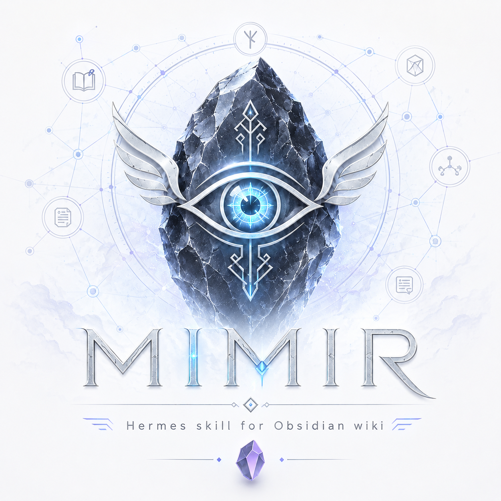

> _Un agent qui se charge, tout seul, de faire vivre un savoir sur Obsidian._

> 🌱 **Projet jeune, mais vivant.** Le pipeline complet tourne déjà — une
> source entre, un wiki relié en ressort. On affine, on élargit, mais le cap
> décrit ici est bel et bien en marche.

> 🗣️ **Un mot sur la langue.** Oui, tout est en français. Je suis **francophone**
> (belge, donc — pas français, on ne se fâche pas) et Mimir est d'abord un projet
> perso que je partage en l'état, dans la langue dans laquelle je l'ai pensé. Une
> version **anglaise / multilingue** est au programme… plus tard. Promis. Quelque
> part entre « bientôt » et « quand les frites seront cuites ». En attendant,
> `Ctrl+T` et un peu d'indulgence font des miracles. 🍟

## L'idée

Mimir est un **second cerveau** qui s'entretient tout seul.

On lui confie des choses qu'on veut garder : un article, un document, une
note, une idée croisée au fil de l'eau. Et plutôt que de les laisser
s'empiler en vrac, Mimir les **digère** : il les relie, les met en forme,
les range, et en fait un savoir vivant — un wiki sur Obsidian qui grandit
et se tisse au fil du temps, sans qu'on ait à s'en occuper.

L'objectif n'est pas d'**accumuler**, mais de **comprendre** : transformer un
flux de sources dispersées en une connaissance claire, navigable et reliée.

## L'esprit

Mimir s'inspire d'une intuition simple : **il faut séparer ce qu'on récolte
de ce qu'on en comprend.**

- D'un côté, la **matière brute** — tout ce qu'on a recueilli, conservé tel
  quel, intact. La trace fidèle de ce qu'on a croisé.
- De l'autre, le **savoir construit** — relu, reformulé, structuré, relié.
  Ce qu'on en a vraiment retenu et compris.

La première couche est la mémoire. La seconde est l'intelligence qu'on en
tire. Mimir fait le pont entre les deux, en continu.

## Ce qu'on veut qu'il fasse

- **Recueillir** sans effort ce qu'on lui donne, d'où que ça vienne.
- **Tisser des liens** entre les idées, pour qu'aucune connaissance ne reste
  isolée.
- **Mettre en forme** : un savoir clair, lisible, organisé par thème.
- **Travailler en fond** : à la demande quand on le sollicite, en silence le
  reste du temps.
- **Rester fidèle** : ne jamais déformer ni perdre ce qu'on lui a confié.

## Ce qu'on ne veut pas

- Un dépotoir où l'on entasse sans jamais relire.
- Un outil qu'il faut nourrir et ranger à la main.
- Une connaissance figée, qu'on n'ose plus retoucher.

## Comment ça marche

Sous le capot, Mimir est une **suite de 6 skills** [agentskills.io](https://agentskills.io)
orchestrés par l'agent **Hermes**. Ensemble, ils forment un pipeline en deux
couches strictes — la **matière brute**, conservée intacte, et le **savoir
reformulé**, relié par notion :

```
Source (PDF · EPUB · URL)
   │
   ├─ wiki-extract  → range la source brute, fidèle et immuable
   ├─ wiki-ingest   → la digère en articles wiki, une notion par page
   ├─ wiki-reading-grid → en tire une grille de lecture ordonnée
   ├─ wiki-index    → reconstruit l'INDEX et vérifie les liens
   └─ wiki-sync     → synchronise le tout vers le vault Obsidian
```

Un sixième skill, **wiki-init**, prépare le terrain au premier usage : il crée
l'arborescence du second cerveau et amorce la synchro.

## Installation

> Pré-requis : [Hermes Agent](https://github.com/NousResearch/hermes-agent)
> installé.

```bash
hermes profile install https://github.com/vivian-maes/mimir.git
hermes update     # ⚠️ seede les skills de base : sans ça, le profil n'a que les 5 wiki-*
```

> **Mise à jour** (profil déjà installé) : **`hermes profile update mimir`** (mise à niveau
> en place). ⚠️ `update` prend le **nom du profil** (`mimir`), **pas l'URL git** : passer l'URL
> échoue (« Profile '…' is not a distribution ») — l'URL ne vaut que pour `install`. Relancer
> `hermes profile install` sans `--force` échoue aussi (« Profile 'mimir' already exists ») ;
> repli : `hermes profile install https://github.com/vivian-maes/mimir.git --force` pour
> réécraser les *distribution-owned files*. Puis `hermes update` pour resynchroniser les
> bundled skills.

Au **premier lancement**, sur un Hermes encore non configuré :

```bash
hermes -p mimir chat     # déclenche l'assistant « hermes setup »
```

L'assistant configure le **provider** (login Nous Portal ou clés API d'un autre
fournisseur), le terminal, et — optionnellement — la **messagerie** (bot Telegram +
service gateway). On peut passer une étape et y revenir avec
`hermes -p mimir setup model`, `hermes -p mimir setup gateway`, etc.

Enfin, déposer `wiki.config.json` dans `~/.hermes/profiles/mimir/` (auto-découvert) et
vérifier : `hermes profile info mimir`.

### Première utilisation

Sur un vault encore vide, **initialiser** d'abord la structure du second cerveau :
demander à Mimir d'« initialiser le wiki » (skill **wiki-init**). Il crée
l'arborescence (`_inbox/`, `raw/`, `wiki/`, `reading-grids/`), un mode d'emploi dans
`_inbox/`, un `INDEX.md` de départ, puis amorce la première synchro. En cas de doute
sur l'emplacement, « où est mon wiki ? » affiche le `wiki.config.json` résolu et tous
les chemins. Ensuite, déposer une source dans `_inbox/` lance le pipeline.

> **Invocation** : toujours via le flag `-p` — `hermes -p mimir <commande>`.
> ⚠️ `hermes mimir chat` est invalide (`mimir` est un **profil**, pas une
> sous-commande de `hermes`). Le raccourci `mimir <commande>` n'existe que si on
> installe avec `--alias`.

## Où on en est

Le pipeline complet tourne de bout en bout, mais c'est encore **jeune** : on
débugge, on tâtonne, ça va beaucoup bouger. Rien n'est figé, et c'est très bien
comme ça.

Du coup, **tout retour est le bienvenu** — un bug croisé, une idée, un usage
auquel on n'avait pas pensé. N'hésitez pas à ouvrir une issue ou à partager
votre expérience.

## Licence

Mimir est distribué sous **[PolyForm Noncommercial License 1.0.0](LICENSE)**
([texte de référence](https://polyformproject.org/licenses/noncommercial/1.0.0)).
Tout usage **non commercial** est permis — usage personnel, recherche, éducation,
associations — y compris modifier, forker et redistribuer. **L'usage commercial est
interdit** sans accord écrit préalable.

> ℹ️ Il s'agit d'une licence **« source-available »**, pas d'une licence open source au
> sens OSI/FSF (lesquelles exigent d'autoriser l'usage commercial).

_Mimir — un second cerveau qui s'entretient tout seul._
